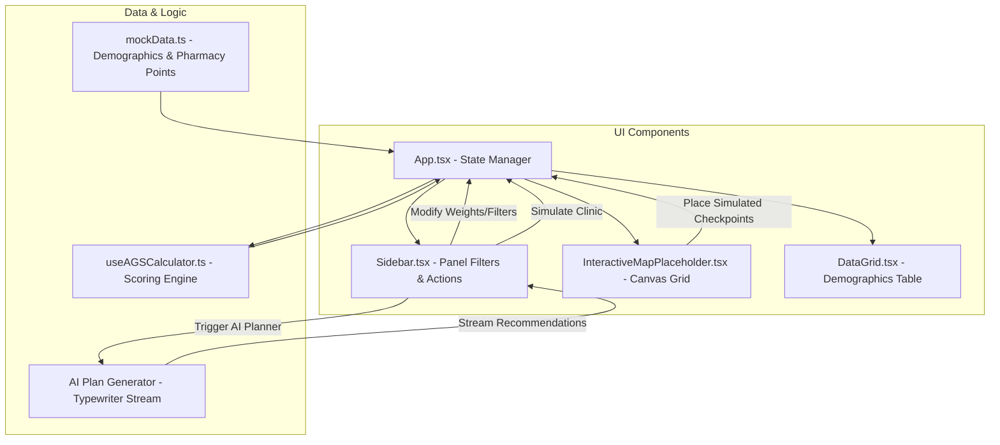

# AegisMap Living Documentation: SDoH Medication Desert Locator

This document outlines the core domain concepts, architectural layout, calculations, and schemas powering **AegisMap: SDoH Medication Desert Locator**.

---

## 1. Core Domain Concepts

Health equity is heavily determined by geographic and socio-demographic factors. AegisMap identifies vulnerable areas using the following indicators:

### Social Determinants of Health (SDoH) Metrics
* **Poverty Rate ($P_r$):** The percentage of households in a census tract living below the federal poverty line. High poverty limits access to private transit and commercial mail services.
* **No-Vehicle Rate ($V_r$):** The percentage of households with zero vehicle ownership. This creates high dependency on public transit or walking.
* **Elderly Rate ($E_r$):** The percentage of the population aged 65 or older. Elderly individuals are more likely to have mobility restrictions and multiple chronic medication requirements.

### Accessibility Gap Score (AGS)
The Accessibility Gap Score (AGS) is a custom composite risk metric calculating accessibility severity for a specific census tract. It weights SDoH indicators and applies geographic distance penalties:

$$\text{Base AGS} = (P_r \times w_p) + (V_r \times w_v) + (E_r \times w_e)$$

Where:
* $w_p$ = Poverty Weight (default: `0.4`)
* $w_v$ = No-Vehicle Weight (default: `0.4`)
* $w_e$ = Elderly Weight (default: `0.2`)
* $\sum w_i = 1.0$

### Travel Threshold & Distance Friction Penalty
If a Census Tract centroid is located further than the travel threshold (default: $20.0$ canvas units, representing approximately a 15-minute travel window) from the nearest pharmacy, it incurs a **Distance Friction Penalty** factor of $1.5\times$:

$$\text{Final AGS} = \begin{cases} 
\text{Base AGS} \times 1.5 & \text{if } D_{\text{pharmacy}} > D_{\text{threshold}} \\
\text{Base AGS} & \text{if } D_{\text{pharmacy}} \le D_{\text{threshold}}
\end{cases}$$

### Mobile Clinic Mitigation
Placing a simulated mobile clinic within the coverage radius ($15.0$ canvas units) of a census tract centroid flags the tract as `isMitigated: true`. This:
1. Waives the distance penalty: $\text{Final AGS} = \text{Base AGS}$.
2. Negates its status as a "Medication Desert".
3. Adds its uncompensated readmission penalty to the "Preventable Penalties Saved" financial ROI tracker.

---

## 2. Architectural Blueprint

The application follows a modular, unidirectional frontend data architecture:



### Key Modules:
* **`mockData.ts`**: Contains structured demographic profiles for 10 mock census tracts and 4 baseline pharmacy point coordinates.
* **`useAGSCalculator.ts`**: The core analytical engine. It runs React memoized evaluations of nearest-neighbor Euclidean distances and computes AGS scores for all tracts dynamically whenever filter weights or clinic positions change.
* **`InteractiveMapPlaceholder.tsx`**: Renders an interactive SVG layout showing mock neighborhood boundary corridors, rivers, highways, tracts, pharmacy crosses, and mobile clinic pins.

---

## 3. Core Type Signatures (API Schema)

```typescript
export interface CensusTract {
  id: string;
  name: string;
  population: number;
  povertyRate: number;    // 0 - 100
  noVehicleRate: number;  // 0 - 100
  elderlyRate: number;    // 0 - 100
  x: number;              // 0 - 100
  y: number;              // 0 - 100
}

export interface ComputedTract extends CensusTract {
  baseAgs: number;
  distanceToNearestPharmacy: number;
  hasDistancePenalty: boolean;
  ags: number;
  isDesert: boolean;
  distanceToNearestMobileClinic?: number;
  isMitigated: boolean;
}

export interface Pharmacy {
  id: string;
  name: string;
  address: string;
  x: number;
  y: number;
}

export interface ClinicCheckpoint {
  id: string;
  label: string;
  x: number;
  y: number;
  isSimulated: boolean;
  createdAt: string;
}
```
