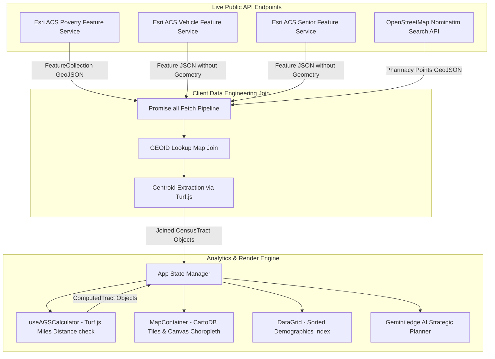

# AegisMap Living Documentation: SDoH Medication Desert Locator

This document outlines the core domain concepts, architectural layout, calculations, and schemas powering **AegisMap: SDoH Medication Desert Locator** (Tier 2).

---

## 1. Core Domain Concepts

Health equity is heavily determined by geographic and socio-demographic factors. AegisMap identifies vulnerable areas in Wayne County (Detroit, MI) using live data streams:

### Social Determinants of Health (SDoH) Metrics
* **Poverty Rate ($P_r$):** The percentage of households in a census tract living below the federal poverty line. Sourced live from the **Esri ACS Poverty Status** feature server.
* **No-Vehicle Rate ($V_r$):** The percentage of households with zero vehicle ownership. Sourced live from the **Esri ACS Vehicle Availability** feature server.
* **Elderly Rate ($E_r$):** The percentage of the population aged 65 or older. Sourced live from the **Esri ACS Senior Highlights** feature server.

### Accessibility Gap Score (AGS)
The Accessibility Gap Score (AGS) is a custom composite risk metric calculating accessibility severity for a specific census tract. It weights SDoH indicators and applies geographic distance penalties:

$$\text{Base AGS} = (P_r \times w_p) + (V_r \times w_v) + (E_r \times w_e)$$

Where:
* $w_p$ = Poverty Weight (default: `0.4`)
* $w_v$ = No-Vehicle Weight (default: `0.4`)
* $w_e$ = Elderly Weight (default: `0.2`)
* $\sum w_i = 1.0$

### Travel Threshold & Distance Friction Penalty
AegisMap evaluates the physical distance from each census tract centroid to the nearest pharmacy in geodesic miles using **Turf.js**:

$$\text{Distance} = \text{Turf.distance}(\text{Centroid}_{\text{tract}}, \text{Coordinates}_{\text{pharmacy}}, \text{"miles"})$$

* **Pharmacy Coverage Radius:** **1.5 miles** (standard walking/driving accessibility threshold).
* **Distance Friction Penalty:** If a census tract's nearest pharmacy distance exceeds **1.5 miles** and it is not mitigated, it receives an automatic **1.5x penalty**:
  $$\text{Final AGS} = \begin{cases} 
  \min(100, \text{Base AGS} \times 1.5) & \text{if } D_{\text{pharmacy}} > 1.5 \text{ miles} \\
  \text{Base AGS} & \text{if } D_{\text{pharmacy}} \le 1.5 \text{ miles}
  \end{cases}$$

### Mobile Clinic Mitigation
Placing a simulated mobile clinic drops a point coordinates marker on the map.
* **Clinic Coverage Radius:** **1.2 miles**.
* If a tract centroid falls within 1.2 miles of any simulated clinic, it gets `isMitigated: true`. This waives the distance penalty, removes its "Medication Desert" status, and updates the dashboard ROI KPI counters.

---

## 2. Architectural Blueprint & Data Pipeline

The application fetches, joins, and processes live geospatial data directly inside the browser client:



### Key API Queries used:
1. **Poverty & Boundaries (GeoJSON Polygons):**
   `https://services.arcgis.com/P3ePLMYs2RVChkJx/arcgis/rest/services/ACS_Poverty_by_Age_Boundaries/FeatureServer/2/query?where=GEOID+LIKE+%2726163%25%27&outFields=GEOID,NAME,B17020_001E,B17020_002E&returnGeometry=true&f=geojson`
2. **Vehicle Availability (JSON Attributes only):**
   `https://services.arcgis.com/P3ePLMYs2RVChkJx/arcgis/rest/services/ACS_Vehicle_Availability_Boundaries/FeatureServer/2/query?where=GEOID+LIKE+%2726163%25%27&outFields=GEOID,B08201_001E,B08201_002E&returnGeometry=false&f=json`
3. **Senior Highlights (JSON Attributes only):**
   `https://services.arcgis.com/P3ePLMYs2RVChkJx/arcgis/rest/services/ACS_Highlights_Senior_Well_Being_Boundaries/FeatureServer/2/query?where=GEOID+LIKE+%2726163%25%27&outFields=GEOID,B01001_001E,B01001_calc_numGE65E&returnGeometry=false&f=json`
4. **OSM Pharmacy Point Coordinates:**
   `https://nominatim.openstreetmap.org/search?q=pharmacy+in+Wayne+County+Michigan&format=geojson&limit=50`

---

## 3. Core Type Signatures (TypeScript Model)

```typescript
import { Polygon, MultiPolygon } from 'geojson';

export interface CensusTract {
  id: string;                 // GEOID (e.g. "26163510900")
  name: string;               // e.g. "Census Tract 5109"
  population: number;
  povertyRate: number;        // %
  noVehicleRate: number;      // %
  elderlyRate: number;        // %
  centroid: [number, number]; // [longitude, latitude]
  geometry: Polygon | MultiPolygon;
}

export interface Pharmacy {
  id: string;
  name: string;
  address: string;
  coordinates: [number, number]; // [longitude, latitude]
}

export interface ClinicCheckpoint {
  id: string;
  label: string;
  coordinates: [number, number]; // [longitude, latitude]
  isSimulated: boolean;
  createdAt: string;
}
```
