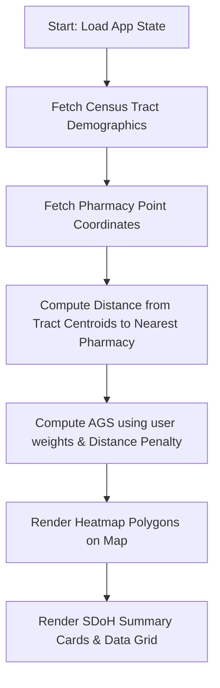

# Project Specifications: Medication "Desert" Locator (AegisMap)

This document outlines the system specification, architecture, data flow, and criteria for the **Medication "Desert" Locator** (AegisMap), a geospatial dashboard designed to optimize SDoH (Social Determinants of Health) outreach.

---

## 1. User Inputs
The dashboard provides interactive controls for planners to adjust variables and run simulations:
* **SDoH Risk Weighting Sliders:**
  * **Poverty Weight ($w_p$):** Weighting factor for poverty rate in calculating the Accessibility Gap Score (AGS) (range: `0.0 - 1.0`).
  * **No Vehicle Weight ($w_v$):** Weighting factor for households without vehicles (range: `0.0 - 1.0`).
  * **Elderly Weight ($w_e$):** Weighting factor for population aged 65+ (range: `0.0 - 1.0`).
  * *Constraint:* The sum of weights is dynamically normalized or constrained to equal `1.0` (default: $w_p = 0.4$, $w_v = 0.4$, $w_e = 0.2$).
* **Demographic Filter Thresholds:**
  * Sliders to filter Census Tracts displayed on the map based on minimum values of:
    * Poverty Rate (%)
    * No-Vehicle Rate (%)
    * Elderly Rate (%)
* **Search / Navigation:**
  * Text input to search for a census tract by Name or ID.
* **Geospatial Interaction:**
  * Zoom and Pan controls on the map interface.
  * Clicking on a Census Tract to view detailed SDoH statistics and trigger simulations.
  * Map-click action to place "Proposed Mobile Clinic Checkpoints" (simulation markers).
* **Persona Simulation Selector:**
  * Switch between two user personas:
    * **Field Operator:** Can view maps, check active clinic schedules, and input daily updates.
    * **Regional Director:** Can alter formula weightings, input/allocate financial budgets, and view cost-penalty reports.
* **Optimization Dispatch:**
  * "Generate Deployment Optimization Plan" button to invoke AI analysis of current high-risk tracts.

---

## 2. Workflows
The application processes spatial data and user commands through the following step-by-step pipelines:

### Workflow A: Risk Assessment Calculation

1. **Data Load:** On mount, the application loads Census Tract geometries (GeoJSON) and Pharmacy locations.
2. **Dynamic Scoring Engine:** A `useMemo`-based calculation runs on the client. For each tract $i$:
   $$\text{AGS}_i = (Poverty_i \times w_p) + (NoVehicle_i \times w_v) + (Elderly_i \times w_e)$$
   * If the tract centroid is further than $d_{\text{threshold}}$ (e.g., 2 miles or 15-minute travel) from the nearest pharmacy, apply a **Distance Friction Penalty** of $1.5 \times$:
     $$\text{Final AGS}_i = \text{AGS}_i \times 1.5$$
3. **Map Rendering:** Color-code each tract polygon by its calculated score:
   * **Low Risk** (AGS < 30): Emerald Green
   * **Medium Risk** (30 - 60): Amber Orange
   * **High Risk** (AGS > 60): Rose Red
4. **Data Synchronization:** Populate the KPI widgets and bottom data grid with computed scores.

### Workflow B: Resource Allocation Simulation
1. **Interactive Placement:** A Regional Director clicks the map or selects a high-risk tract and clicks "Simulate Resource Allocation".
2. **Coordinate Registration:** A temporary mobile clinic marker is registered at the target location.
3. **Recalculation:** The routing engine evaluates the coverage radius (e.g., 1.5-mile radius) around the new clinic.
4. **Desert Mitigation:** Any census tracts intersecting this coverage zone are temporarily removed from the "Medication Desert" list, updating the high-risk count and estimated readmissions cost saved ($) in the header in real-time.
5. **Persistence (Tier 3):** If approved, the checkpoint is written to Supabase `mobile_deployments`.

### Workflow C: AI Diagnostic Synthesis
1. **Selection:** The system identifies the top 3 tracts with the highest AGS scores.
2. **Payload Construction:** Creates a JSON payload detailing the tracts' demographics, calculated risk, and current lack of pharmacies.
3. **LLM Query:** Dispatches the payload to the Gemini API (`gemini-2.5-flash`) via edge runtime.
4. **Output Rendering:** Displays a structured, typewriter-animated plan in the "AI Resource Planner" panel showing proposed routing, budget, and community outreach templates.

---

## 3. Tools & Technologies
The following tech stack will be used:
* **Frontend Library:** React 18+ bootstrapped with **Vite** for rapid hot reloading and optimized assets.
* **Programming Language:** **TypeScript** configured in strict mode (no `any`, strict null checks, defined types/interfaces).
* **Package Manager:** **pnpm** (no `npm` or `yarn` calls allowed).
* **Styling Framework:** **Tailwind CSS** for dashboard layouts, fluid dark/light transitions, and animations.
* **Map Engine:**
  * *Tier 1:* High-fidelity Interactive SVG coordinate canvas mimicking geographic boundaries.
  * *Tiers 2-3:* **Leaflet.js** via `react-leaflet` combined with **Turf.js** for client-side spatial intersections (checking if tract centroids fall within pharmacy service polygons).
* **Visualization:** **Recharts** for demographic distributions, AGS composite charts, and financial ROI trends.
* **AI Provider:** **Gemini API** using secure client fetch from `.env` variables (`VITE_AI_API_KEY`).
* **Database & Auth:** **Supabase** (PostgreSQL with PostGIS extension enabled) for persisting clinic checkpoints and handling user role states.
* **Deployment Tooling:** **gh-pages** for static distribution, with `vite.config.ts` base path configured.

---

## 4. Expected Outputs
* **KPI Metrics Dashboard:**
  * *High-Risk Tracts Identified:* Count of tracts with AGS > 60.
  * *Cost Penalty Avoided:* Calculated savings estimate based on avoided 30-day readmissions (e.g., $15,000 per readmission avoided).
  * *Active Clinics:* Number of mobile clinic routes scheduled or simulated.
* **Interactive Map View:**
  * Choropleth mapping of census tracts.
  * Overlay icons for pharmacies (teal crosses) with transparent 15-minute buffers.
  * Overlay icons for simulated/active mobile clinics.
* **Census Tract Data Grid:**
  * Sortable, searchable table displaying Name, Population, SDoH parameters, AGS, and status.
* **AI Planner Panel:**
  * Markdown-rendered deployment guides, budgets, and outreach scripts.
* **Analytics Tab:**
  * Composite Bar-Line chart for tract vulnerability.
  * Budget vs Penalties Saved cost projection bar chart.
* **Theme & Role State Indicator:**
  * Current persona badge (Operator/Director).
  * Smooth dark/light toggle button.

---

## 5. Data Storage
* **Census Tract & Pharmacy Data:**
  * *MVP (Tier 1):* Local TypeScript constants representing 10 tracts and 4 pharmacies.
  * *Tier 2:* Asynchronous fetching of public GeoJSON files and mock pharmacy JSON points.
  * *Tier 3:* Supabase tables:
    * `census_tracts`: standard attributes + `geom` column (Geometry type).
    * `pharmacies`: coordinates + service details.
* **User-Generated Metrics:**
  * *MVP/Tier 2:* Local React state and `localStorage` to preserve simulated mobile clinic placements between reloads.
  * *Tier 3:* Supabase `mobile_deployments` table with fields: `id`, `created_at`, `geom` (Point), `label`, `estimated_cost`, `created_by`.

---

## 6. Deployment Vector
* **Production Deployment:** GitHub Pages static site hosting.
* **Base Configuration:** `vite.config.ts` base path configured to match `/intern_med_desert/`.
* **Deployment Pipeline:** `pnpm run deploy` utilizing the `gh-pages` script which runs a production build and pushes the `dist` folder to the remote `gh-pages` branch.

---

## 7. Definition of "Done" for the MVP (Milestone 1)
To verify the initial MVP before proceeding to further tiers, the build must satisfy the following conditions:
1. **Zero-Config Launch:** Running `pnpm install` and `pnpm run dev` launches the dashboard without errors.
2. **Strict Type Safety:** Compilation through `pnpm run build` completes with zero TypeScript or build configuration errors.
3. **Interactive SDoH Calculator:** Modifying weights or filtering variables immediately re-computes AGS for all tracts and adjusts map/grid states.
4. **Map Simulation Canvas:** User can hover and click on tracts in the interactive SVG layout to inspect statistics and trigger mock resource simulations.
5. **Polished Design:** A high-end dark mode UI matching the premium specifications (Zinc/Slate background, Emerald/Teal active nodes, Amber/Rose warnings).
6. **Code Review:** Clean code structure, separated hooks, and zero `any` usage.
